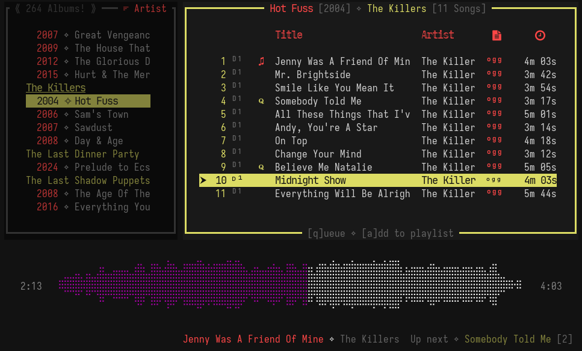

# Concertus - v0.1.0

Concertus is a lightweight, plug and play, TUI music player written in Rust.



## Usage

To try Concertus, do the following:

```bash
git clone https://github.com/Jaxx497/concertus/
cd concertus
cargo run --release 

# to intall globally:
cargo install --path .
```

Begin by assigning one or more root directories when promted. The root
management window can be accessed by pressing the ``` ` ``` key at any time.
Concertus will walk through the supplied folder(s), and create a virtual
library based on any valid files it finds.

It's recommended that users have ffmpeg installed for waveform visualization.
This dependency however is not mandatory.

Concertus aims to create an experience where no task is more than a keystroke
or two away. Those familiar with vim-like bindings should pick up the
keybindings quickly. Use `hjkl`/`d`/`u` for navigation, `n`/`p` for seeking, and `/`
for searching. 

For the full list of keymaps, refer to the [keymaps
documentation](./docs/keymaps.md). \
For information on custom themeing, refer to the [themeing
specification](./docs/themes.md).

Currently, concertus supports the following filetypes: ```mp3, m4a, flac, ogg, wav```

## Disclaimers

Concertus never writes to user files and does not have any online capabilities.
The program does however rely on accurate tagging. It's strongly recommended
that users ensure their libraries are properly tagged with a tool like
[MP3Tag](https://www.mp3tag.de/en/). 

> **Tip:** Concertus supports hot reloading by pressing `Ctrl+u` or `F5` at any
> point during runtime.

## Known bugs

1. Symphonia/Rodio Related*
    1. There are no reliable Rodio compatible OPUS decoders.
    1. Seeking can be potentially unstable.
    1. Gapless playback is not viable for the time being.

> **Note:** This project is heavily reliant on the Symphonia and Rodio crates.
Many of the playback related issues are due to upstream issues in the
aforementioned libraries. Following several QOL additons, I intend to explore
new backend options. 

## TODO 

- Display more song info in window (user controlled)
- Improved testing for various formats
- Implement a secondary backend (likely mpv) [Finally, OPUS support!!!]
- Import/Export playlists

## Other

Concertus is a hobby project primary written for educational purposes. This
project seeks to demonstrate my understanding of a series of programming
fundamentals, including but not limited to multi-threading, atomics, string
interning, database integration, de/serialization, memory management, integrity
hashing, session persistence, OS operations, modular design, view models, 
state management, user customization, and much more. 
